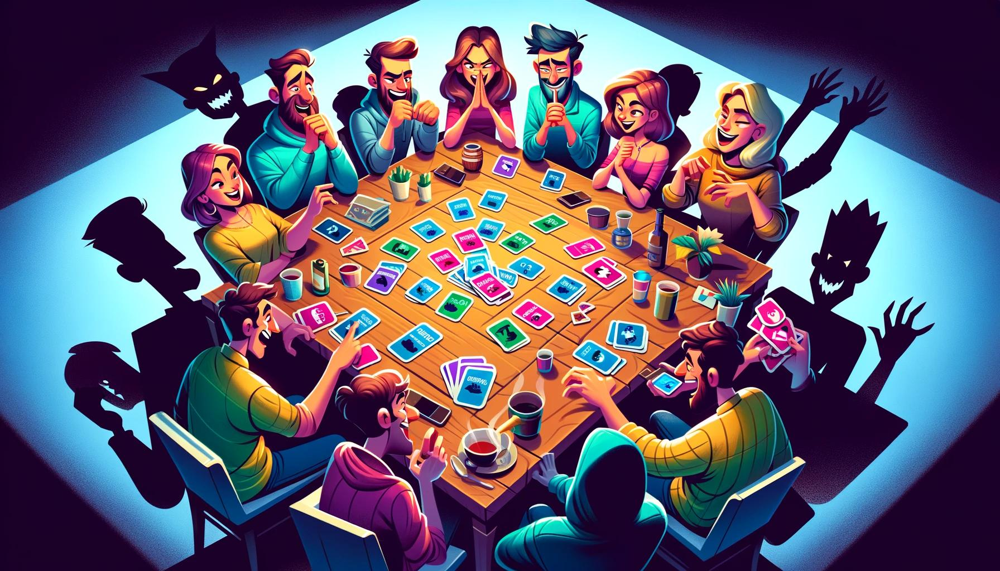
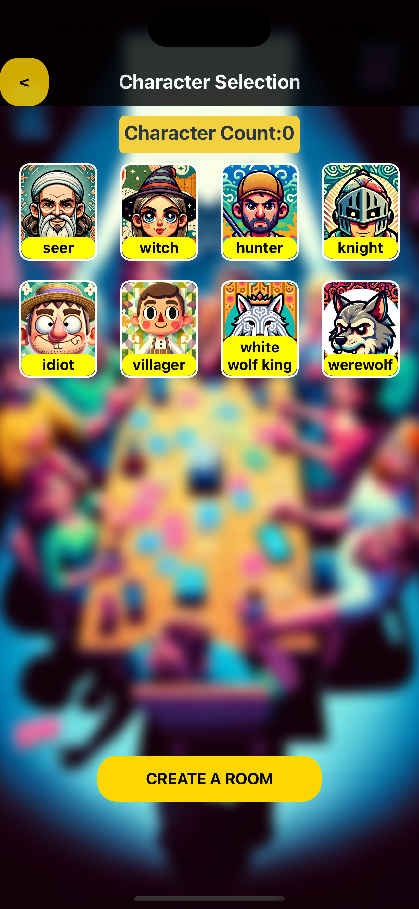

# 狼人殺 Werewolf Kill Cross-platform Sideproject



## Game Description

"狼人殺" is a popular social deduction game. It is also known as "Werewolf" in English. In this game, players are assigned different roles, such as villagers, werewolves, and special characters, each with unique abilities and objectives.

The goal of the game is for the villagers to identify and eliminate the werewolves, while the werewolves try to deceive the villagers and eliminate them one by one. The game is played in rounds, with players discussing and debating to figure out who the werewolves are. At the end of each round, players vote to eliminate a player they suspect to be a werewolf. The game continues until either all the werewolves are eliminated or the werewolves outnumber the villagers.

## Our Goal

The aim is to build an offline assistant for the game. This assistant will allow players to play the game without the need for a human moderator. Typically, in a traditional game of Werewolf, one player acts as the moderator and facilitates the game by assigning roles, managing the game flow, and resolving conflicts. However, with this offline assistant, players can enjoy the game without anyone having to take on the role of the moderator.

Additionally, the project aims to address the issue of limited options for game assistant. This means that the current available options for game assistants may be limited in terms of features, user experience, or accessibility. The goal is to create a comprehensive and user-friendly offline assistant that provides a seamless and enjoyable experience for players of 狼人殺.

## Installation

```bash
# Clone the repository
git clone https://github.com/username/project.git

# Navigate to the directory
cd project

# Install dependencies
npm install
```

## Current Process

<!--  -->

<!--  -->


<!--  -->

